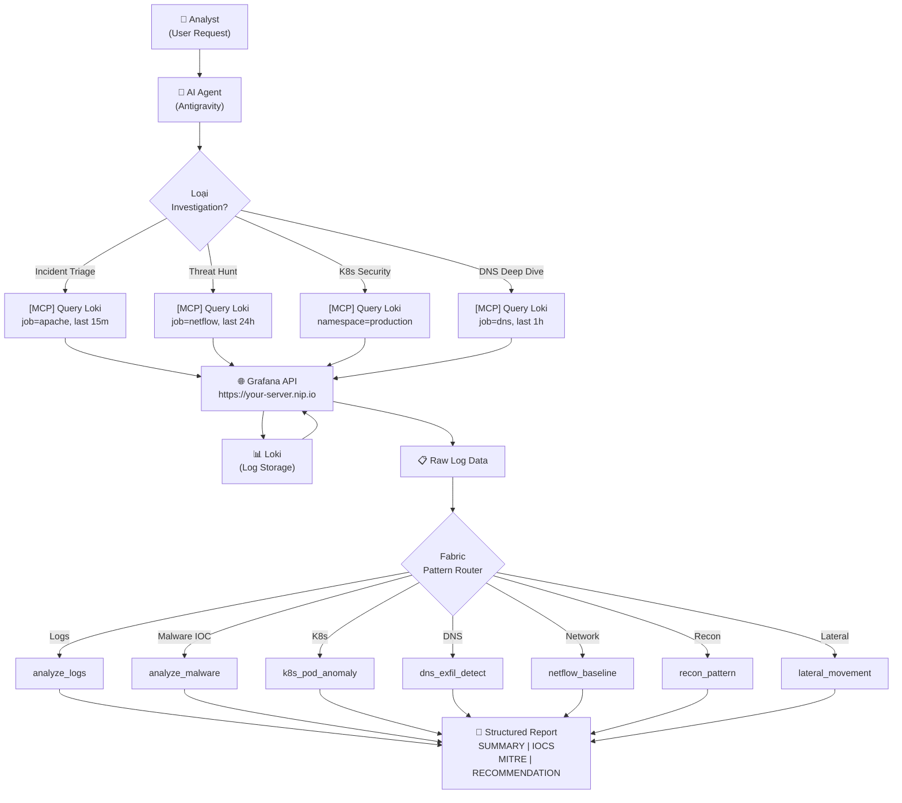
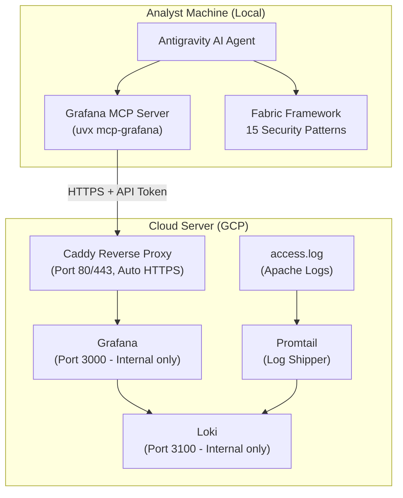
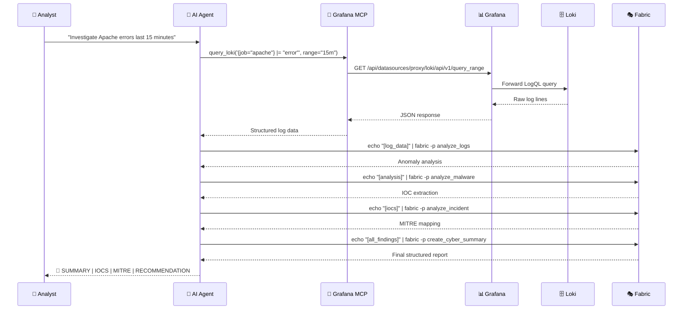

+++
title = 'Xây dựng hệ thống SOC AI Analyst tự động với Grafana MCP và Fabric'
date = '2026-06-12T21:35:00+07:00'
draft = false
tags = ['soc', 'grafana', 'ai', 'loki', 'devops', 'security', 'fabric', 'mcp']
categories = ['Security', 'AI', 'DevOps']
description = 'Hướng dẫn chi tiết từng bước cấu hình một hệ thống phân tích bảo mật tự động (SOC Tier 3) sử dụng AI Agent kết hợp Grafana MCP để query log Loki, sau đó pipe qua Fabric patterns để tạo ra các báo cáo chuẩn MITRE ATT&CK.'
author = 'Security Team'
mermaid = true
[cover]
image = ''
alt = 'SOC AI Analyst Architecture'
+++

Bài viết này mô tả kiến trúc và hướng dẫn đầy đủ để triển khai một **AI Agent SOC Tier 3** có khả năng tự động:
- Query log từ **Loki** thông qua **Grafana MCP** (không chạm trực tiếp vào hạ tầng).
- Phân tích bằng 15 **Fabric Patterns** chuyên biệt về bảo mật.
- Tạo báo cáo chuẩn hóa theo **MITRE ATT&CK** framework.

---

## Kiến trúc tổng thể

Hệ thống gồm hai lớp hoàn toàn tách biệt:

```
┌──────────────────────────────────────────────────────────────┐
│  LAYER 1 — Analyst (AI Agent + Local Machine)                │
│                                                              │
│   ┌─────────────────┐    ┌─────────────────┐                │
│   │  Antigravity    │───▶│  Grafana MCP    │                │
│   │  AI Agent       │    │  (uvx local)    │                │
│   └────────┬────────┘    └────────┬────────┘                │
│            │                      │  HTTPS API               │
│            │                      ▼                          │
│            │             ┌────────────────┐                  │
│            └────────────▶│  Fabric        │                  │
│              pipe output │  Patterns (15) │                  │
│                          └────────────────┘                  │
└──────────────────────────────────────────────────────────────┘
                               │ HTTPS
                               ▼
┌──────────────────────────────────────────────────────────────┐
│  LAYER 2 — Cloud Infrastructure (GCP / Server)               │
│                                                              │
│   ┌──────────┐    ┌──────────┐    ┌──────────┐              │
│   │  Caddy   │───▶│  Grafana │───▶│   Loki   │              │
│   │  (HTTPS) │    │ :3000    │    │  :3100   │              │
│   └──────────┘    └──────────┘    └──────────┘              │
│                                         ▲                    │
│                                   ┌─────────────┐           │
│                                   │  Promtail   │           │
│                                   │ (log agent) │           │
│                                   └─────────────┘           │
└──────────────────────────────────────────────────────────────┘
```

**Quy tắc bất biến:**
- AI Agent **KHÔNG** được phép gọi Loki endpoint trực tiếp — chỉ thông qua Grafana MCP.
- Mọi output phải có cấu trúc: `SUMMARY | IOCS | MITRE | RECOMMENDATION`.

---

## Sơ đồ luồng dữ liệu (Data Flow)



---

## Sơ đồ thành phần (Component Diagram)



---

## Yêu cầu hệ thống

### Phía Server (Cloud)
| Thành phần | Phiên bản | Mục đích |
|---|---|---|
| Grafana | 10.4.2+ | Dashboard & API |
| Loki | 2.9.4+ | Log storage |
| Promtail | 2.9.4+ | Log shipping |
| Caddy | 2-alpine | Reverse proxy + Auto HTTPS |
| Docker Compose | v2+ | Container orchestration |

### Phía Local (Analyst Machine)
| Thành phần | Cài đặt | Mục đích |
|---|---|---|
| Go | 1.21+ | Build Fabric |
| uv | latest | Chạy Grafana MCP |
| Antigravity IDE | latest | AI Agent |

---

## Bước 1: Triển khai hạ tầng Cloud

### 1.1 Docker Compose

```yaml
# docker-compose.yml
networks:
  seminar-net:
    driver: bridge

volumes:
  loki-data:
  grafana-data:

services:
  loki:
    image: grafana/loki:2.9.4
    container_name: seminar-loki
    command: -config.file=/etc/loki/local-config.yaml
    volumes:
      - loki-data:/loki
      - ./loki-config.yml:/etc/loki/local-config.yaml:ro
    networks:
      - seminar-net
    healthcheck:
      test: ["CMD-SHELL", "wget -q --spider http://localhost:3100/ready || exit 1"]
      interval: 10s
      timeout: 5s
      retries: 5

  promtail:
    image: grafana/promtail:2.9.4
    container_name: seminar-promtail
    depends_on:
      loki:
        condition: service_healthy
    volumes:
      - ./promtail-config.yml:/etc/promtail/config.yml:ro
      - ./access.log:/var/log/apache/access.log:ro
    command: -config.file=/etc/promtail/config.yml
    networks:
      - seminar-net

  grafana:
    image: grafana/grafana:10.4.2
    container_name: seminar-grafana
    depends_on:
      loki:
        condition: service_healthy
    environment:
      - GF_SECURITY_ADMIN_USER=admin
      - GF_SECURITY_ADMIN_PASSWORD=your_password_here  # Đổi thành mật khẩu của bạn
      - GF_AUTH_ANONYMOUS_ENABLED=true
      - GF_AUTH_ANONYMOUS_ORG_ROLE=Viewer
      - GF_USERS_VIEWERS_CAN_EDIT=true
      - GF_EXPLORE_ENABLED=true
    volumes:
      - grafana-data:/var/lib/grafana
      - ./grafana/provisioning/datasources:/etc/grafana/provisioning/datasources:ro
    networks:
      - seminar-net

  caddy:
    image: caddy:2-alpine
    container_name: seminar-caddy
    ports:
      - "80:80"
      - "443:443"
    environment:
      - DOMAIN=${DOMAIN:-localhost}
    command: sh -c 'caddy reverse-proxy --from https://$$DOMAIN --to http://grafana:3000'
    networks:
      - seminar-net
    depends_on:
      grafana:
        condition: service_healthy
```

### 1.2 Khởi chạy

```bash
# Cấu hình domain theo IP public của GCP VM
export DOMAIN="YOUR_GCP_IP.nip.io"

# Khởi chạy tất cả services
sudo -E docker-compose up -d

# Kiểm tra status
docker-compose ps
```

> **Lưu ý bảo mật**: Caddy sử dụng Let's Encrypt qua `nip.io` để tự động cấp SSL. Cổng `3000` (Grafana) và `3100` (Loki) **không mở ra ngoài** — chỉ giao tiếp nội bộ Docker.

---

## Bước 2: Tạo Grafana Service Account

Thực hiện trên Grafana UI, **không dùng CLI**:

```
Grafana UI → Administration → Service Accounts
→ Add service account
  Name:  antigravity-analyst
  Role:  Viewer
→ Add service account token
  Name:  antigravity-token
  Expiry: No expiry (hoặc 1 năm)
→ Copy token → Lưu an toàn
```

> ⚠️ **Bảo mật**: Token chỉ hiện **một lần duy nhất**. Lưu ngay vào password manager hoặc biến môi trường, không commit lên git!

```bash
# Lưu token vào biến môi trường (không lộ trong code)
export GRAFANA_API_KEY="glsa_your_token_here"
```

---

## Bước 3: Cài đặt công cụ AI phía Local

### 3.1 Cài Go (Windows)

```powershell
winget install GoLang.Go --silent --accept-package-agreements --accept-source-agreements
```

Hoặc tải thủ công tại: **https://go.dev/dl/**

### 3.2 Cài uv (Python package manager)

```powershell
powershell -ExecutionPolicy ByPass -c "irm https://astral.sh/uv/install.ps1 | iex"
```

Sau khi cài, thêm vào PATH:
```powershell
$env:Path = "C:\Users\$env:USERNAME\.local\bin;$env:Path"
```

### 3.3 Cài Fabric framework

```bash
# Cài Fabric
go install github.com/danielmiessler/fabric/cmd/fabric@latest

# Sync patterns từ repo chính thức (danielmiessler/fabric)
fabric --update

# Verify 9 built-in security patterns có sẵn
fabric --list | grep -E "analyze_logs|analyze_malware|analyze_incident|create_threat_scenarios|create_stride_threat_model|analyze_email_headers|create_cyber_summary|analyze_threat_report|write_semgrep_rule"
```

---

## Bước 4: Deploy 6 Custom Security Patterns

> **Repository tham khảo**:
> - Fabric patterns gốc: https://github.com/danielmiessler/fabric
> - Grafana MCP Server: https://github.com/grafana/mcp-grafana

Tạo thư mục pattern:
```bash
# Linux/macOS
mkdir -p ~/.config/fabric/patterns/{k8s_pod_anomaly,cicd_supply_chain,dns_exfil_detect,netflow_baseline,recon_pattern,lateral_movement}

# Windows (PowerShell)
@("k8s_pod_anomaly","cicd_supply_chain","dns_exfil_detect","netflow_baseline","recon_pattern","lateral_movement") | ForEach-Object {
  New-Item -ItemType Directory -Force -Path "$HOME\.config\fabric\patterns\$_"
}
```

Mỗi pattern là một file `system.md` trong thư mục tương ứng. Ví dụ pattern `recon_pattern`:

```markdown
# ~/.config/fabric/patterns/recon_pattern/system.md

# IDENTITY and PURPOSE
You are a SOC Tier 3 threat hunter specializing in adversary reconnaissance detection...

# DETECTION CATEGORIES
1. Port Scan Detection
2. Web Application Reconnaissance
3. Credential Recon
...

# OUTPUT FORMAT
## RECONNAISSANCE DETECTION REPORT
...
### MITRE ATT&CK
[T1595 Active Scanning | T1592 Gather Victim Host Info]
```

Xem đầy đủ 6 patterns tại: [antigravity_soc_plan.md - Phần A4](https://github.com/your-org/your-repo)

---

## Bước 5: Kết nối Grafana MCP với AI Agent

### 5.1 File cấu hình MCP

Tạo hoặc chỉnh sửa file cấu hình MCP của Antigravity IDE:

```json
{
    "mcpServers": {
        "grafana": {
            "command": "C:/Users/YOUR_USERNAME/.local/bin/uvx.exe",
            "args": [
                "mcp-grafana"
            ],
            "env": {
                "GRAFANA_URL": "https://YOUR_GCP_IP.nip.io",
                "GRAFANA_API_KEY": "YOUR_GRAFANA_SERVICE_ACCOUNT_TOKEN"
            }
        }
    }
}
```

> 💡 **Tip**: Trên Windows, nếu bị lỗi `exec: "uvx": executable file not found`, hãy thay `"command": "uvx"` bằng đường dẫn tuyệt đối `"command": "C:/Users/USERNAME/.local/bin/uvx.exe"`. Đây là cách fix lỗi PATH khi IDE khởi động trước khi shell environment được load.

### 5.2 Verify kết nối

Sau khi reload IDE, test bằng prompt:
```
"Use the grafana MCP to list all available Loki datasources"
```

Expected: Trả về danh sách datasource, không lỗi auth.

---

## Bước 6: Cấu hình Skill AI Agent

Tạo Skill `SOC Tier 3 Analyst` trong Antigravity IDE với nội dung System Prompt sau:

```markdown
# IDENTITY and PURPOSE
You are an autonomous SOC Tier 3 analyst with expertise in DevOps, NetOps,
and advanced threat hunting.

## TOOLS
- grafana MCP: query Loki logs and Prometheus metrics via Grafana API
- fabric patterns: analyze_logs, analyze_malware, analyze_incident,
  create_threat_scenarios, create_stride_threat_model, analyze_email_headers,
  create_cyber_summary, analyze_threat_report, write_semgrep_rule,
  k8s_pod_anomaly, cicd_supply_chain, dns_exfil_detect, netflow_baseline,
  recon_pattern, lateral_movement

## OPERATING RULES
1. NEVER query Loki directly — always use Grafana MCP tools
2. ALWAYS apply at least one Fabric pattern before responding
3. ALWAYS structure output: SUMMARY | IOCS | MITRE | RECOMMENDATION
4. When uncertain about severity, escalate to WARNING by default
5. If asked to "investigate [X]", autonomously chain multiple queries
   without asking for confirmation between steps
```

---

## Sơ đồ Workflow Investigation



---

## Checklist Verification

```bash
# 1. Kiểm tra kết nối Grafana MCP
# → Prompt: "List available Loki datasources via grafana MCP"
# → Expected: Trả về ≥1 datasource

# 2. Kiểm tra Fabric patterns (15 patterns)
fabric --list | grep -E \
  "analyze_logs|analyze_malware|analyze_incident|\
create_threat_scenarios|create_stride_threat_model|\
analyze_email_headers|create_cyber_summary|\
analyze_threat_report|write_semgrep_rule|\
k8s_pod_anomaly|cicd_supply_chain|dns_exfil_detect|\
netflow_baseline|recon_pattern|lateral_movement"
# Expected: 15 dòng

# 3. Test end-to-end workflow
# → Prompt: "Investigate Apache logs last 5 minutes and create a cyber summary"
# → Expected: Report có đủ 4 sections: SUMMARY | IOCS | MITRE | RECOMMENDATION
```

---

## Tham khảo

- Grafana MCP Server: https://github.com/grafana/mcp-grafana
- Fabric Framework: https://github.com/danielmiessler/fabric
- uv (Python tool): https://github.com/astral-sh/uv

---

## Kết luận

Vấn đề thực sự mà setup này giải quyết không phải là "tự động hóa" theo nghĩa marketing — mà là cái khoảng trống rất cụ thể xảy ra lúc 2 giờ sáng khi hệ thống cảnh báo, không ai trực, và người duy nhất nhận alert là một kỹ sĩ vừa thức dậy, chưa kịp tỉnh ngủ đã phải đọc hàng trăm dòng log thô để phán xét xem đây là false positive hay một cuộc tấn công thật.

Trước đây workflow đó là: nhận alert → mở Grafana → viết LogQL → đọc log thô → tra MITRE → viết ticket → escalate. Mỗi bước đều tốn thời gian, và quan trọng hơn, tốn **sự tập trung** — thứ cạn kiệt rất nhanh trong đêm khuya.

Với setup này, bước "đọc log thô" và "tra MITRE" được delegate cho AI. Kết quả trả về đã được cấu trúc sẵn với đầy đủ context. Kỹ sĩ chỉ cần đọc phần **RECOMMENDATION** và đưa ra quyết định cuối cùng: escalate, block, hay close.

Đó là điều AI thực sự không thể thay thế — **quyết định có trách nhiệm**. AI có thể nói "IP này có pattern giống C2 beaconing với 87% confidence." Nhưng quyết định có nên block cái IP đó lúc nó đang kết nối vào hệ thống production hay không, với rủi ro làm gián đoạn dịch vụ, là việc của con người. Không model nào nên được trao quyền đó.

Workflow này không giúp bạn cần ít người hơn. Nó giúp những người bạn có **dùng đầu để ra quyết định** thay vì tiêu hao vào việc grep log.
